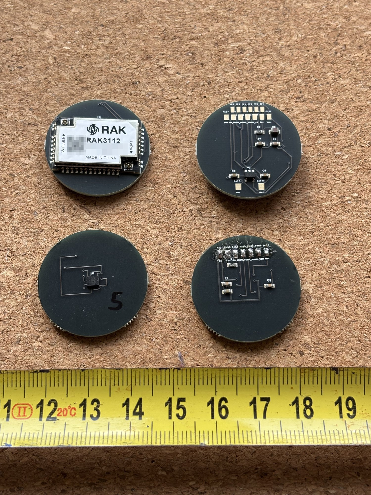
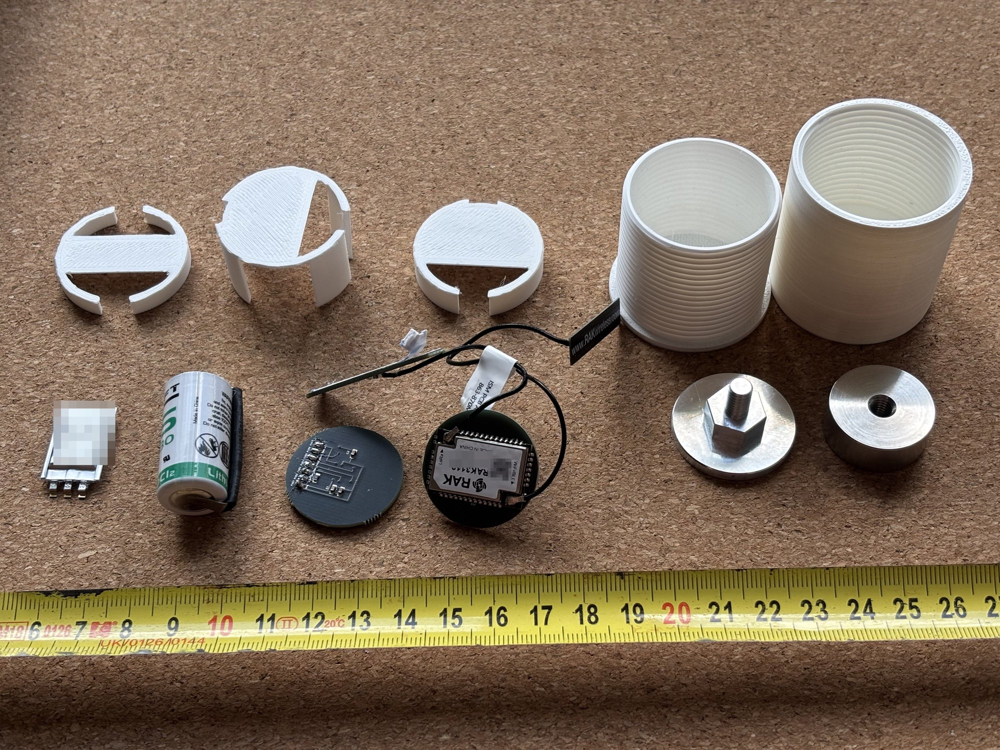

# Open Vibration Node

An open hardware and open firmware vibration sensing node for industrial condition
monitoring — analysing vibration **on the device** and reporting results over LoRaWAN to a
gateway you run yourself, with no mandatory cloud service.

> **Status: sensor board verified, radio path not yet exercised.** The second-generation
> sensor board has been manufactured and verified on the bench — the sensor identifies
> correctly, gravity and impact-response tests pass, and the noise floor sits at ~18 mg RMS
> across the full 6.3 kHz bandwidth on a bench ([measurements](docs/measurements.md)). The RAK3112 module has so far served only as the
> host MCU for those tests; the SX1262 radio has not yet been brought up. Mechanical
> integration and the signal-processing firmware are the current work.

*The two 28 mm boards that make up a node — sensor board and radio board, both sides.
More photographs: [docs/images](docs/images/).*

## Why this project exists

Predictive maintenance works: measuring vibration on motors, bearings, pumps and fans
reveals developing faults weeks or months before they cause a breakdown. The techniques
are well documented in engineering literature, and the sensors cost a few euros.

Access to them is not open, though. Commercial condition-monitoring systems are closed
end to end — proprietary sensors, proprietary gateways, and a vendor cloud that must stay
reachable and paid for, or the equipment stops being monitored. Prices start in the
hundreds of euros per measurement point, which puts continuous monitoring out of reach for
small manufacturers, municipal utilities, water pumping stations and building services —
exactly the operators who can least afford an unplanned failure.

Open vibration-monitoring projects do exist. The ones I have found stop at a development
board on a desk, depend on a vendor cloud, or use accelerometers limited to a few hundred
hertz — which rules out the 1–6 kHz region where bearing faults first appear. What is
missing is a node that combines the bandwidth needed for real diagnostics with local-first
operation and documentation good enough to rebuild it. This project aims to be that node.

## How this compares with existing work

| Approach | Usable bandwidth | Power / connectivity | Openness |
|---|---|---|---|
| Commercial condition-monitoring systems | Full (piezo-based) | Battery or wired; vendor cloud mandatory | Closed end to end; per-point pricing plus subscription |
| Open builds on consumer MEMS (ADXL345 / LIS3DH class) | ~200–800 Hz | Battery; various | Open, but physically blind to the 1–6 kHz bearing-fault region |
| Wired piezo + DAQ setups | Full | Mains power and cabling per point | Mixed; cabling dominates per-point cost |
| **This project** | **DC–6.3 kHz (IIS3DWB)** | **Battery + LoRa; local-first, no mandatory cloud** | **Open: hardware, firmware, docs, production files** |

Open lab-instrument projects — open microscopes, open test equipment — have already shown
that *laboratory-grade but open and rebuildable* is a workable model. This project applies
that model to industrial vibration monitoring.

## Design goals

These are the goals the design is being built towards, not a description of what already
works — see the status above.

- **Analysis on the device.** FFT and envelope processing run on the node's MCU. Only
  results leave the device — a compact payload of dominant frequencies, amplitudes, RMS
  and temperature (target: under 24 bytes), not raw waveforms. This is what makes
  battery-powered operation over a low-bandwidth radio possible at all.
- **Local-first.** LoRaWAN with a self-hosted [ChirpStack](https://www.chirpstack.io/)
  network server: the reference gateway is a Raspberry Pi 5 with an SX1302 eight-channel
  concentrator, and everything from radio to database runs on hardware the operator owns.
  No account, no vendor cloud, no remote kill switch. Cloud services are optional, never
  required.
- **Auditable and reproducible.** Schematics, bill of materials, firmware source and
  enclosure models under free licences, with build documentation detailed enough to
  reproduce a working node.
- **Long field life.** Multi-year operation on a primary lithium cell. Sealed enclosure
  for industrial and outdoor use.
- **Secure by design.** Per-device keys, signed firmware updates and a published software
  bill of materials, so that nodes remain maintainable under the EU Cyber Resilience Act
  rather than becoming unsupported hardware.

## Hardware

| Block | Part | Key figures |
|---|---|---|
| Accelerometer | STMicroelectronics **IIS3DWB** | DC–6.3 kHz flat bandwidth, 26.667 kHz ODR, 75 µg/√Hz noise density, ±2/4/8/16 g, SPI, −40…+105 °C, integrated temperature sensor |
| MCU + radio | RAK Wireless **RAK3112** | ESP32-S3 + Semtech SX1262 in one certified module (LoRa 868 MHz, WiFi, BLE), 23×15 mm |
| Power | Diodes **AP2112K-3.3** LDO | 600 mA, SOT-23-5 (LCSC C51118) |

### Why these parts

**IIS3DWB.** Bearing and mechanical fault signatures live in the 1–6 kHz region, while
ordinary MEMS accelerometers (ADXL345, LIS3DH and similar) are limited to 200–800 Hz —
they physically cannot see what matters. The IIS3DWB gives a flat 6.3 kHz bandwidth at
75 µg/√Hz noise in a single 2.5 × 3.0 mm package, so diagnostics that previously required
a piezoelectric accelerometer with an external conditioner now fit in a 28 mm node running
from a battery.

**RAK3112.** The ESP32-S3 has enough compute to run the FFT locally, which is the whole
premise of the design: the node transmits a spectral summary rather than raw waveforms,
which is what makes both the battery budget and the LoRa duty cycle work. Combining it
with the SX1262 in one certified module means a single component instead of MCU plus radio
plus RF matching, and no antenna network to design. The trade-off is board area in
exchange for reproducibility and a simpler certification path — a deliberate choice for a
project that others are meant to be able to rebuild.

*Everything that goes into one node: the two boards, primary cell, energy buffer,
antennas, printed housing and the aluminium mounting pad.*

### Board architecture

Two 28 mm round boards with the battery between them, joined by seven wires:

- **Sensor board** — IIS3DWB on the bottom layer, facing the measured surface, with
  decoupling capacitors and a CS pull-up.
- **Radio board** — RAK3112 on the top layer (antenna facing away from metal), LDO and
  power components underneath.

Inter-board signals: `GND`, `3V3`, `SPI_CS`, `SPI_SCK`, `SPI_MISO`, `SPI_MOSI`, `INT1`.
Pad order is identical on both boards, so the wires run straight across without crossing.

Placing the accelerometer on the bottom layer is deliberate — it shortens the mechanical
path between the measured surface and the sensing element, which matters far more for
signal fidelity than any amount of filtering afterwards.

### Two data paths

A node normally sends only a spectral summary — a payload of a couple of dozen bytes,
which is what makes years of battery life on a low-bandwidth radio possible at all. That
summary is enough to trend a machine's condition, but not to investigate a fault in detail.

So the node keeps a second path. The RAK3112 carries 8 MB of PSRAM, enough to hold about
50 seconds of the full 26.667 kHz three-axis stream. When something in the trend needs
looking at, an engineer standing next to the machine can trigger a capture and pull the
raw recording off over WiFi, straight to a laptop — no cloud and no gateway involved.
This path works on the bench as of September 2026: a downlink command makes the node record
32768 samples per axis (1.23 s) from the sensor FIFO into PSRAM and post them over WiFi to
the collector, which it locates by mDNS.

This is deliberately **on demand** rather than continuous: streaming raw data would end the
battery budget within days. Routine monitoring stays cheap; full detail is available when
it is actually needed.

## Repository layout

| Path | Contents |
|---|---|
| `firmware/tests/` | Bench verification sketches — sensor identification and acquisition |
| `docs/` | Measurements, payload specification draft, build notes |
| `enclosure/` | Mounting pad and housing — CAD sources with open-format exports |
| `tools/` | Design-check utilities: a mirrored-footprint checker and the velocity-RMS filter validation script |
| `hardware/` | KiCad boards plus gerbers, BOM and pick-and-place files for both boards |

## Licences

- Firmware and software: [MIT](LICENSE)
- Hardware design files: CERN-OHL-W-2.0 (see `hardware/LICENSE.txt`)
- Documentation: CC-BY-SA-4.0

## Roadmap

Timing is indicative and assumes part-time development; with project funding it compresses.

1. ~~Sensor board validated on hardware~~ — done, August 2026 ([measurements](docs/measurements.md))
2. ~~Radio bring-up: SX1262 transmit and receive path~~ — done, September 2026: point-to-point
   LoRa link (869.525 MHz, SF7) in both directions, downlink-configurable cadence within the
   duty-cycle budget, on-demand raw capture over WiFi; velocity RMS in the ISO 10816 band
   validated ([measurements](docs/measurements.md#velocity-rms-in-the-iso-10816-band-added-2-september-2026))
3. Mechanical integration: sensor coupling, sealing, field-ready housing (pad and housing
   models [published](enclosure/); sealing details in progress) — winter 2026/27
4. On-device FFT and envelope processing, LoRaWAN uplink with a versioned payload format
   ([draft specification](docs/payload-spec.md)) — spring 2027. *Interim: FFT, envelope and
   waterfall spectra are computed on the collector from FIFO captures; each packet already
   carries band-limited velocity RMS, crest factor and a sensor-health flag
   ([status](docs/payload-spec.md#bench-protocol-status-2-september-2026)).*
5. Characterisation against a reference accelerometer on a shaker — spring/summer 2027
6. Field deployment on real rotating equipment, with published measurement data — second
   half of 2027
7. Documented reproducible build — someone else assembles a node from this repository —
   late 2027

## About

Built by Laurynas Misiūnas, an electronics engineer in Klaipėda district, Lithuania, with
six years of industrial experience deploying edge AI vision systems and embedded
controllers on production lines. Developed with the support of the Klaipėda Science and
Technology Park (KMTP) innovation support programme.

Contributions, review and questions are welcome — see [CONTRIBUTING.md](CONTRIBUTING.md) or open an issue.

## Transparency: use of generative AI

Engineering decisions, architecture and project direction in this repository are made by
the author. Documentation and English-language texts are drafted with the assistance of a
large language model (Anthropic Claude) and reviewed, corrected and approved by the author
before publication. Commits with LLM-assisted content carry a `Co-Authored-By: Claude`
trailer. Details in [TRANSPARENCY.md](TRANSPARENCY.md).

No firmware, hardware design files or measurement data will be presented as project
deliverables without human authorship and verification.
