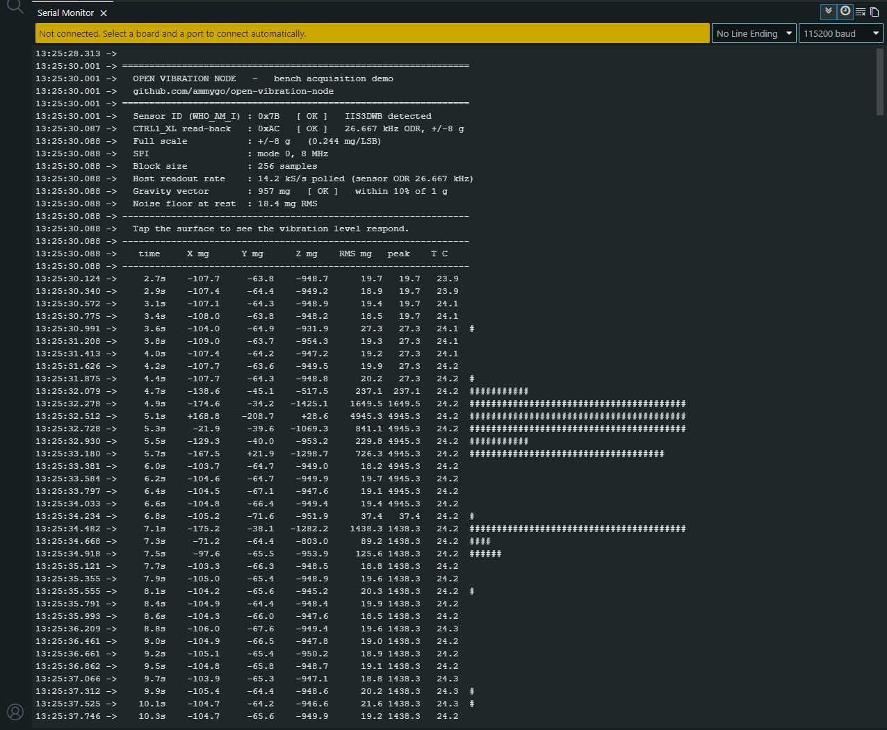

# Bench measurements

Characterisation of the second-generation sensor board. Configuration: IIS3DWB at
26.667 kHz ODR, ±8 g range, 256-sample windows, SPI Mode 0.

These are **characterisation** results — they describe how the hardware behaves, not how
faults are diagnosed. A shaker comparison against a reference accelerometer is still to be
done.

> **Correction, 28 August 2026.** The noise floor originally published here (~1 mg RMS)
> was measured with a misconfigured sensor and has been replaced. See
> [Errata](#errata-sensor-was-running-at-the-wrong-rate) below — the story of how the
> error surfaced is worth more than the number itself.

## Results

| Measurement | Result |
|---|---|
| Sensor identification (`WHO_AM_I`) | `0x7B`, stable across 7/7 read cycles |
| SPI mode | Mode 0 only; Mode 3 returns `0x00` — the part does not respond in Mode 3 |
| Noise floor at rest, full bandwidth | **~18 mg RMS** (256-sample window, bench surface) |
| Gravity, face down | Z ≈ −957 mg |
| Gravity, inverted | Z ≈ +1018 mg |
| Impact response (tap test) | RMS rises from the noise floor to 77 / 155 / 412 / 900 mg depending on strength |
| Settling after impact | Returns to noise floor in under 1 s |
| On-die temperature | Stable, 26.5–26.9 °C |

Gravity, orientation, identification and settling behaviour are unaffected by the
correction below. The tap-test amplitudes were recorded during initial bring-up and
demonstrate dynamic range and settling rather than absolute amplitude at full bandwidth.

*The `bench_demo` sketch reporting identity, configuration read-back, gravity vector and
noise floor, followed by live samples — the spikes are taps on the bench surface.*

## What these numbers mean

The sign of the gravity reading flips correctly when the board is inverted and the
magnitude sits close to 1 g in both orientations, which confirms axis orientation and
scale factor.

The ~18 mg RMS noise floor is measured across the full 6.3 kHz bandwidth on an ordinary
bench. For reference, the datasheet noise density of 75 µg/√Hz over that bandwidth gives a
theoretical floor of about 5.9 mg for the sensor alone; the difference is the environment —
building vibration reaching the bench, and microphonics in the flying-lead harness between
the two boards. Reducing it is a mechanical and wiring problem, not a sensor problem, and
it is one of the things the enclosure work has to address.

The practical consequence: at full bandwidth on this setup, vibration below roughly 18 mg
RMS is not distinguishable from the background. Narrowing the analysis band — which is what
the FFT does — recovers sensitivity within the bands of interest.

The tap test spans nearly three orders of magnitude without saturating and settles back
within a second, showing the acquisition chain has usable dynamic range and no ringing
that would smear later spectral analysis.

## Errata: sensor was running at the wrong rate

The first published noise floor was ~1 mg RMS. That figure was real in the sense that the
instrument reported it — but it was impossible. With 75 µg/√Hz across 6.3 kHz, no
configuration of this part can produce 1 mg RMS; the arithmetic alone puts the floor near
5.9 mg.

What had happened: the configuration register `CTRL1_XL` was being written as `0x2C`, an
undocumented bit combination. The part accepted it and ran at roughly 105 Hz instead of
26.667 kHz. A 105 Hz bandwidth genuinely does produce a ~1 mg floor — the measurement was
correct for a sensor doing something other than what the code claimed.

The error surfaced from timing, not from reading the datasheet again: sample blocks were
taking far longer to fill than 26.667 kHz would allow. A diagnostic sketch that measured
actual sample rate against register contents confirmed it — `0x2C` gave 105 Hz, `0xAC`
gave full rate, and reading the register back returned what was written.

The correct value is `0xAC`: `XL_EN[2:0] = 101` in bits 7:5, the only permitted setting for
26.667 kHz, with ±8 g in bits 3:2. The bit layout is documented in ST application note
AN5444 rather than the main datasheet register map, which is how the wrong value survived
review in the first place.

Two things worth taking from this. First, always verify the configuration you believe you
wrote — read the register back and check the resulting sample rate, which the sketches
here now do. Second, a measurement that looks better than physics allows is a bug report,
not a result.

## Not yet measured

- Frequency response against a shaker with a calibrated reference accelerometer
- Behaviour across the full −40…+105 °C range
- Long-term drift
- Power consumption in duty-cycled operation

## Reproducing

The sketches under [`../firmware/tests/`](../firmware/tests/) produce these readings:
`sensor_id` verifies the SPI link and part identity, `acquisition` streams mean, RMS and
temperature, and `bench_demo` runs the full self-check sequence including the register
read-back described above.
