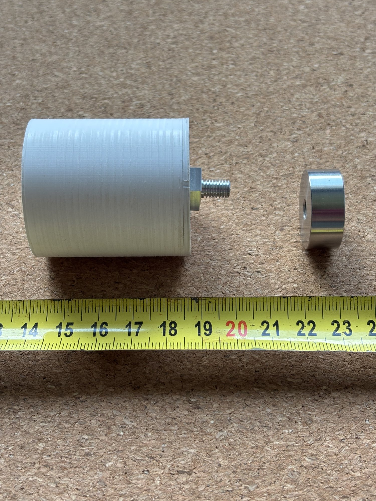

# Enclosure and mechanical parts

Licence: CERN-OHL-W-2.0 (same terms as `../hardware`); documentation CC-BY-SA-4.0.

| Path | Contents |
|---|---|
| `mounting-pad/` | Threaded pad coupling the sensor board to the machine surface — published |
| `housing/` | Sensor housing, revision 3 — published, sealing details in progress |

*The node screws onto the pad by its M6 stud; the pad is turned into the machine housing.
Assembled views: [upright](../docs/images/assembled-node-upright.jpg),
[side](../docs/images/assembled-node-side.jpg),
[opened](../docs/images/housing-open.jpg).*

## Design notes

The enclosure has to do three things at once: transmit vibration faithfully from the
mounting surface to the sensor, keep moisture and dust out, and not shield the antenna.

Planned approach: a stiff mounting path from the pad through the board to the sensor, a
gasket groove for an EPDM or silicone O-ring cord (printed gaskets leak through layer
lines and are not used for sealing), a membrane-vented port to equalise pressure without
admitting water, and a radio-transparent section over the antenna.

Materials: current prototypes are printed in PLA, which is adequate for fit checks on the
bench and nothing more. Field units need ASA for outdoor and UV exposure, or PC/PC-FR where
surface temperatures are high; both require a heated chamber to print without warping, and
printer requirements will be documented alongside the profiles.

Threaded brass inserts are used for all fasteners; printed threads do not survive repeated
opening or vibration.
